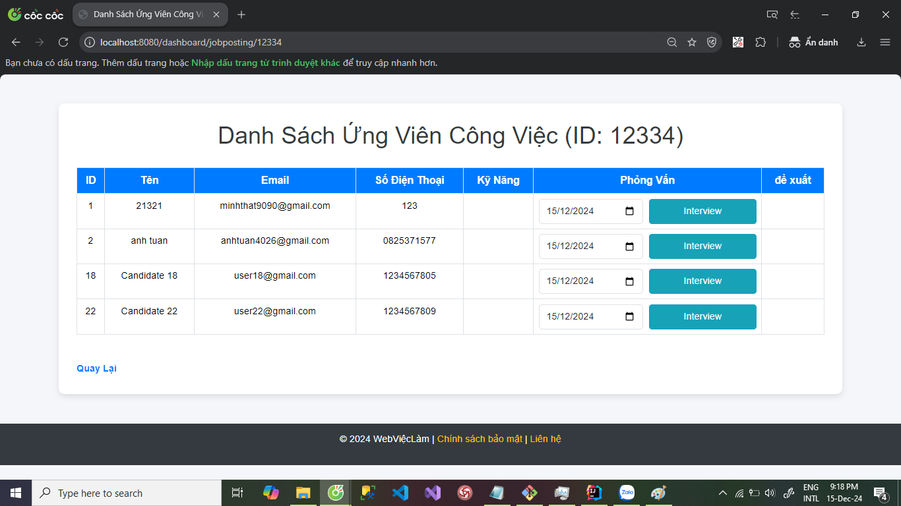

# Lab05_WWW
## Sinh viên 
- **Họ và tên: Lê Minh Thật** 
- **MSSV: 21086061** 
- **Videodemo:** 
[Click để xem video trên YouTube](https://youtu.be/aDeJ7ret4EI)
# Hướng Dẫn Cài Đặt và Sử Dụng Hệ Thống
## Công Nghệ Sử Dụng
- **Frontend:** HTML, CSS, JavaScript, Bootstrap
- **Backend:** Java, Spring Boot, Spring Data JPA, MariaDB, tích hợp ChatGPT (API Key không đủ tiền), Ollama gema2:9b (AI chạy gây tràn RAM máy tính nên không thể demo được)
- **Database:** HeidiSQL
- **IDE:** IntelliJ IDEA
- **Documentation:** README.md
- **Version Control:** Git, GitHub

## Tính Năng
### Đăng Nhập Phân Quyền bằng Spring Security
- Sau khi đăng nhập, hệ thống sẽ tự động điều hướng người dùng tới trang **Dashboard** tùy theo **role** của người dùng.

### Các Tính Năng Theo Role:
#### 1. **HR:**
   - Thuộc về một công ty và có thể thực hiện các tính năng của HR:
     - Đăng nhập, đăng xuất.
     - Xem bài post về công việc.
     - Thay đổi trạng thái các bài post để ẩn với ứng viên.
     - Tự động gửi mail nhanh mời phỏng vấn.
   - **Thông tin đăng nhập:**  
     - **Username:** hr1  
     - **Password:** admin123

#### 2. **Candidate:**
   - Thực hiện các tính năng của Candidate:
     - Xem tất cả các bài post về công việc.
     - Ứng tuyển nhanh.
   - **Thông tin đăng nhập:**  
     - **Username:** candidate1  
     - **Password:** admin123

#### 3. **Admin:**
   - Thực hiện các tính năng của cả **Candidate** và **HR**.
   - **Thông tin đăng nhập:**  
     - **Username:** admin  
     - **Password:** admin123

## Hướng Dẫn Sử Dụng
1. **Clone Project:**
   - Sử dụng lệnh sau để clone project từ GitHub về máy tính:
     ```bash
     git clone https://github.com/That909kk/WWW_Lab05.git
     ```

2. **Mở Project:**
   - Mở project bằng IntelliJ IDEA và đợi cho đến khi các dependencies được tải xuống đầy đủ.

3. **Chạy HeidiSQL:**
   - Mở HeidiSQL và chạy file **work.sql** để tạo cấu trúc database.

4. **Cấu Hình Kết Nối Database:**
   - Mở file `application.properties` và chỉnh sửa thông tin kết nối database:
     - Thay đổi **username** và **password** sao cho phù hợp với cơ sở dữ liệu của bạn.
     - Lấy **API-key** OpenAI tại [Đây](https://platform.openai.com/api-keys) (Hướng dẫn lấy tại [Đây](https://viblo.asia/p/lam-the-nao-de-su-dung-api-cua-openai-n1j4lRxlLwl)).
     - Thêm **API-key** vào cấu hình.
     - Thay đổi email gửi thông báo về công việc cho ứng viên vào `spring.mail.username`.
     - Lấy mật khẩu ứng dụng của Gmail theo hướng dẫn tại [Đây](https://fptshop.com.vn/tin-tuc/thu-thuat/cach-tao-mat-khau-ung-dung-gmail-146054).

5. **Chạy Project:**
   - Sau khi hoàn tất cấu hình, bạn có thể chạy project bằng cách truy cập vào địa chỉ:
     ```
     http://localhost:8080
     ```
     Để mở trang **Đăng nhập**.

6. **Sử Dụng Ứng Dụng:**
   - Sau khi đăng nhập, hệ thống sẽ điều hướng bạn đến trang **Dashboard** theo **role** của người dùng.
[Click để xem video trên YouTube](https://youtu.be/aDeJ7ret4EI)

## Lưu Ý
- **Bảo mật API-key và mật khẩu ứng dụng** là rất quan trọng. Đảm bảo rằng bạn không chia sẻ hoặc lưu trữ các thông tin này ở nơi không an toàn.

## Hình Minh Họa
### Trang index:

### Trang login:

### Trang logout:

### Trang Admin Dashboard:

### Trang HR Dashboard:

### Trang Candidate Dashboard:

### Trang Ứng tuyển thất bại:

### Trang Ứng tuyển thành công:

### Trang tạo bản tin:

### Trang ứng cử viên dược phân trang:

### Trang ứng cử viên đã ứng cử bản tin công việc đó:

## 👨‍💻 Tác Giả:
## That909kk
## 🌐 GitHub: [That909kk](https://github.com/That909kk)
